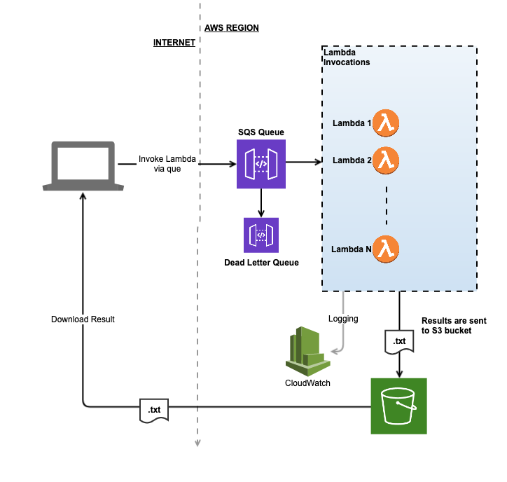
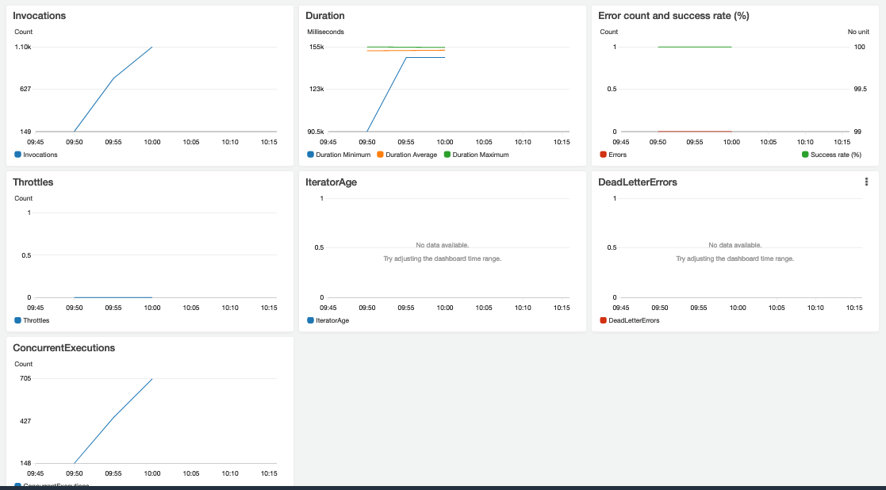

# BCrypter

A Bcrypt password cracker based on AWS Lambda functions.

# Why

BCrypt was designed for passwords, and hence is much slower than other hash algorithms like SHA1 or SHA2.

It's also not GPU-friendly, and can't be parallelized using GPUs.

Hence the only true way to crack them is by using large amounts of parallel processes, of which Lambda's have plenty.

# How

The solution compares the brcypt hash against the top 1 million passwords from [seclist](https://github.com/danielmiessler/SecLists/tree/master/Passwords/Common-Credentials) and returns a match if found.

By default as many as 1000 parallel lambda functions are invoked, each capable of ~3.3 bcrypt hashes at work factor of 12.

# How fast

At full speed, with a work factor of 12, we're able to reach speeds of ~3000 hashes per second. This is roughly 4x faster than [8 Nvidia GTX 1080 cards running in parallel](https://gist.github.com/epixoip/a83d38f412b4737e99bbef804a270c40).

Note: The benchmark linked is for work factor 5, which is 128 times slower than work factor 12.

# Installation

Before you install this, please note this is still wildly inefficient. 1 million hashes with work factor 12 will cost ~$7.00 or your entire free-tier on lambda. This was done purely for fun and academic purposes.

The solution also takes time to fully ramp up on speed -- but it will eventually reach 3,000 hashes per second.

Pre-requisites: [Serverless Framework](serverless.com)

    $ cd serverless
    $ sls deploy
    $ cd .. 
    $ python3 -m venv venv/
    $ source venv/bin/activate
    $ python3 brypter.py
    
# Running

To run, copy your hash into the `bcrypter.hash` file.

    $ ./bcrypter -n 100 -p 100

use the -h option for help on variables

# Architecture

# Million hashes in 10 minutes

# Why Python

Python isn't the best option for this, but it's the language I'm most familiar with.

That being said, the bcrypt package in Python is actually compiled into C, and C **is** the best language for this.
